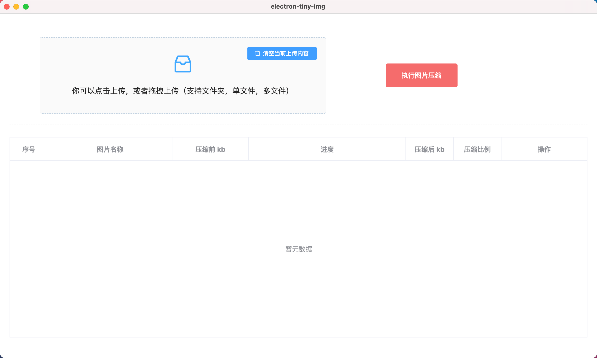
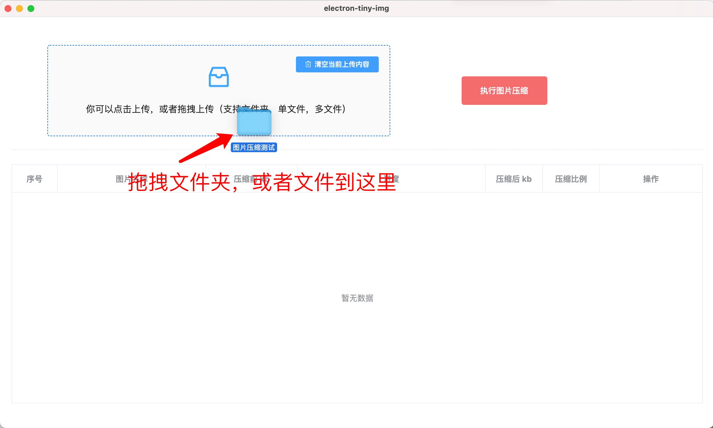
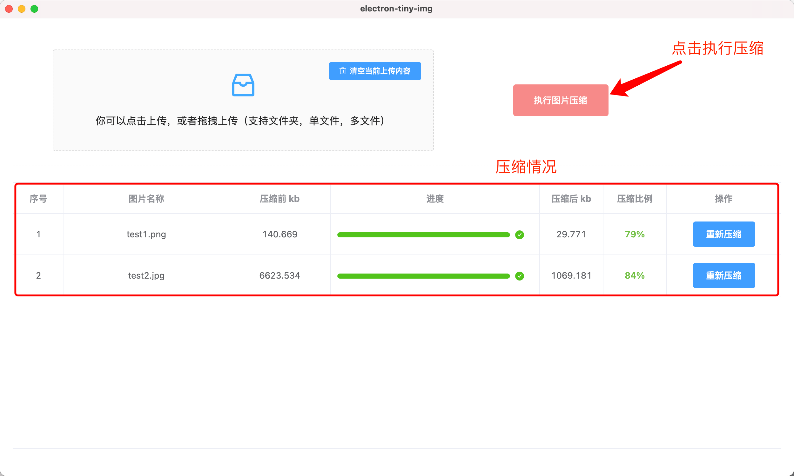

# electron-tiny-img

图片无损压缩客户端（有你想要的所有功能）

### 为什么要做这个？

主要是有压缩图片的需要，但是去找了一圈，发现都有点麻烦

例如有的需要压缩之后，再下载下来
有点不支持文件夹内所有图片压缩，还得一张张上传

为了做一个自己感觉比较方便的压缩图片工具，我开发了这个项目

---
### 功能介绍

> 版本：v1.0.0

- 1.可以选择文件夹，图片文件，图片或者文件夹混合，这几种方式来进行压缩
    - 文件夹：可以压缩这个文件夹下所有的 png 和 jpg 图片
    - 图片文件：选择单张图片，或多张图片，可以压缩单或多张图片
    - 图片和文件夹混合：支持选择文件夹和图片混合的方式，最后都会压缩的
- 2.压缩完成之后，替换原来的图片（重要功能）
- 3.压缩进度展示（压缩之后还能对特定的一条再重复压缩）
- 4.打包成Mac程序（window程序暂时未开放）
- 5.其他功能：没有数量限制，图片大小开放到10MB

---

### 使用说明





---

### 开发与调试

```sh
# 下载依赖（electron依赖包下载很慢，注意得等一段时间）
npm install

# 开发调试
npm run start

# 打包（只打包成一个应用程序）| 有时候会包403的错误，是因为远程下载electron需要翻墙
npm run pack

# 打包（打包Mac系统下所有内容，包括应用程序，zip文件，dmg安装文件等）
npm run dist
```

---

### 文件目录介绍

- src：源文件（就是后台那一套）
- electron：electron 逻辑文件夹
- public：公共文件
