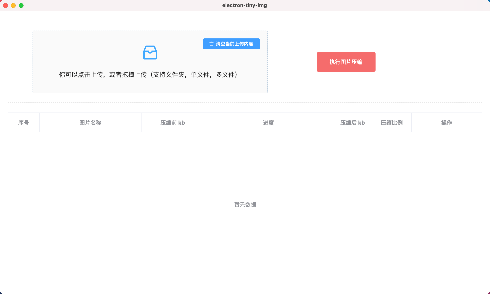
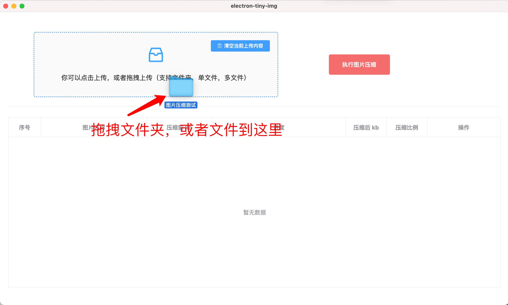
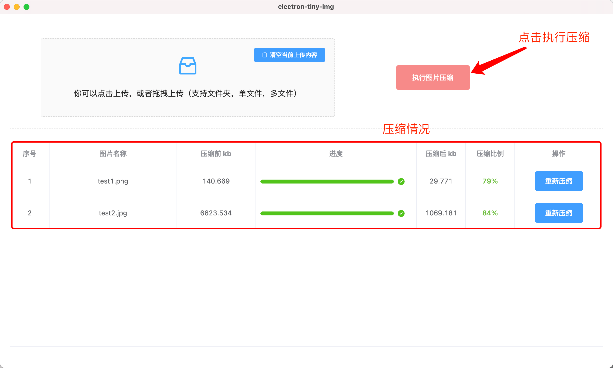

# 图片无损压缩客户端

<p align="center">
    <a href="javascript:;"></a>
    <a href="javascript:;"></a>
    <a href="javascript:;"></a>
    <a href="javascript:;"></a>
    
</p>

---
### 👋 为什么要做这个？

主要是有压缩图片的需要，但是去找了一圈，发现都有点麻烦

- 例如有的需要压缩之后，再下载下来，再替换
- 有点不支持文件夹内所有图片压缩，还得一张张上传，也不支持图片和文件夹混合压缩
- 有的我压完之后感觉不够，还想压缩，就还得走一遍流程，很繁琐

为了做一个自己感觉比较方便的压缩图片工具，我开发了这个项目

---

### 🔭 重要说明

- dmg安装包已经打包好了，放到了版本记录里面 [点这里](https://github.com/zhukunpenglinyutong/electron-tiny-img/releases/tag/1.0.0)
- 本程序必须联网才可正常使用
- 本项目是无损压缩，不用担心压缩之后失真，默认压缩完成会覆盖源文件

---
### 📫 功能介绍

> 版本：v1.1.0（开发中）

- [ ] 优化使用体验
    - [x] 增加新的应用图标
    - [ ] 增加加载loading
- [ ] 新增功能
    - [ ] 图片预览功能
    - [ ] 图片导入，并支持多选功能

---

> 版本：v1.0.0（✅ 已发布）

- [x] 可以选择文件夹，图片文件，图片或者文件夹混合，这几种方式来进行压缩
    - [x] 文件夹：可以压缩这个文件夹下所有的 png 和 jpg 图片
    - [x] 图片文件：选择单张图片，或多张图片，可以压缩单或多张图片
    - [x] 图片和文件夹混合：支持选择文件夹和图片混合的方式，最后都会压缩的
- [x] 压缩完成之后，替换原来的图片（重要功能）
- [x] 压缩进度展示（压缩之后还能对特定的一条再重复压缩）
- [x] 打包成Mac程序（window程序暂时未开放）
- [x] 其他功能：没有数量限制，图片大小开放到10MB

---

### 🍀 使用说明





---

### 🛠 开发与调试

```sh
# 下载依赖（electron依赖包下载很慢，注意得等一段时间，如果很慢可以看 下面步骤 国内用户快速安装electron ）
npm install

# 开发调试
npm run start

# 打包（只打包成一个应用程序）| 有时候会包403的错误，是因为远程下载electron需要翻墙
npm run pack

# 打包（打包Mac系统下所有内容，包括应用程序，zip文件，dmg安装文件等）
npm run dist
```

---

### 🏅 国内用户快速安装electron

```sh
# 打开文件.npmrc
npm config edit
 
# 插入
electron_mirror=http://npm.taobao.org/mirrors/electron/
 
# 保存
 
# 再运行 npm install 就会变得很快
npm install
```

---

### 🏆 源码目录介绍

- src：源文件（Vue-cli生成的模板项目）
- electron：electron 逻辑文件夹
- assets：放置一些图片和图标


